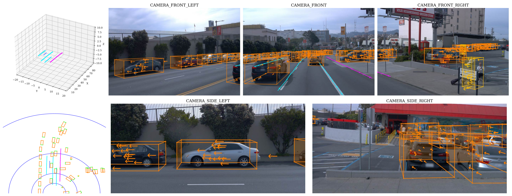
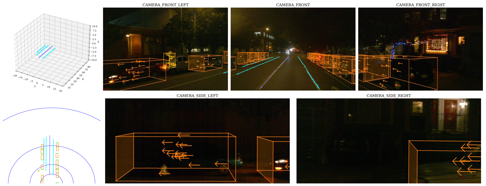
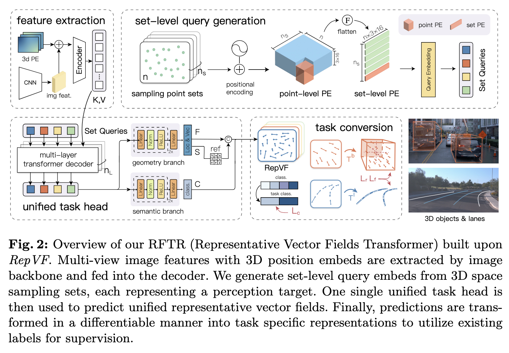

# RepVF: A Unified Vector Fields Representation for Multi-task 3D Perception

Official implementation for 'RepVF: A Unified Vector Fields Representation for Multi-task 3D Perception' (ECCV 2024).

 

# News

[2024/7/21] Data toolkit and our code have been released. Weights and demo data will be uploaded later.

[2024/7/16] RepVF has been released on [arxiv](https://arxiv.org/abs/2407.10876).

[2024/7] Our work has been accepted by **ECCV2024**.

# Abstract

Concurrent processing of multiple autonomous driving 3D perception tasks within the same spatiotemporal scene poses a significant challenge, in particular due to the computational inefficiencies and feature competition between tasks when using traditional multi-task learning approaches. This paper addresses these issues by proposing a novel unified representation, RepVF, which harmonizes the representation of various perception tasks such as 3D object detection and 3D lane detection within a single framework. RepVF characterizes the structure of different targets in the scene through a vector field, enabling a single-head, multi-task learning model that significantly reduces computational redundancy and feature competition. Building upon RepVF, we introduce RFTR, a network designed to exploit the inherent connections between different tasks by utilizing a hierarchical structure of queries that implicitly model the relationships both between and within tasks. This approach eliminates the need for task-specific heads and parameters, fundamentally reducing the conflicts inherent in traditional multi-task learning paradigms. We validate our approach by combining labels from the OpenLane dataset with the Waymo Open dataset. Our work presents a significant advancement in the efficiency and effectiveness of multi-task perception in autonomous driving, offering a new perspective on handling multiple 3D perception tasks synchronously and in parallel.

# Method

# Getting Started

1. [environment configuration instructions](docs/envir.md)
2. [data preparation](docs/data.md)
3. [training and inference scripts](docs/script.md)

# Bibtex

🚧

# Acknowledgement

This work was supported in part by the FDCT grants 0102/2023/RIA2, 0154/2022/A3, and 001/2024/SKL, the MYRG-CRG2022-00013-IOTSC-ICI grant and the SRG2022-00023-IOTSC grant.
